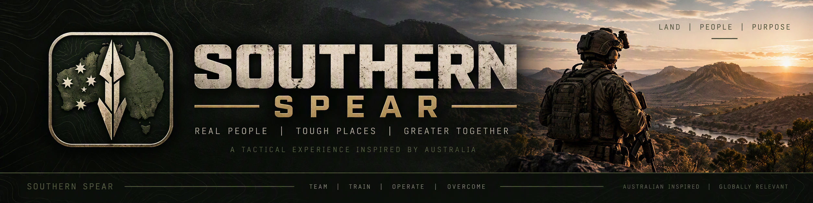

# Southern Spear — website

Public website and development log for **Southern Spear**, a free, community-developed,
Australian-inspired tactical multiplayer FPS built on Unreal Engine 5.8 and the Lyra Starter Game.

**Status:** pre-alpha, in active development. There is no playable release yet.

- Live site: https://theantipopau.github.io/southernspear-site/
- Rolling changelog: [`data/CHANGELOG.md`](data/CHANGELOG.md), one entry per working session
- Roadmap: [`data/DEVELOPMENT_ROADMAP.md`](data/DEVELOPMENT_ROADMAP.md)

This repository is generated from the private game repository by `Tools/publish_site.py`.
It contains only the website and published documentation, with no engine, Lyra or game content.

## Disclaimer

Southern Spear is an original work of fiction. It is not endorsed, sponsored, developed or
approved by the Australian Government, the Department of Defence, the Australian Defence Force
or the Australian Army. All organisations, units, forces and weapons are fictional. It is not
affiliated with America's Army. Unreal Engine is a trademark of Epic Games, Inc.
