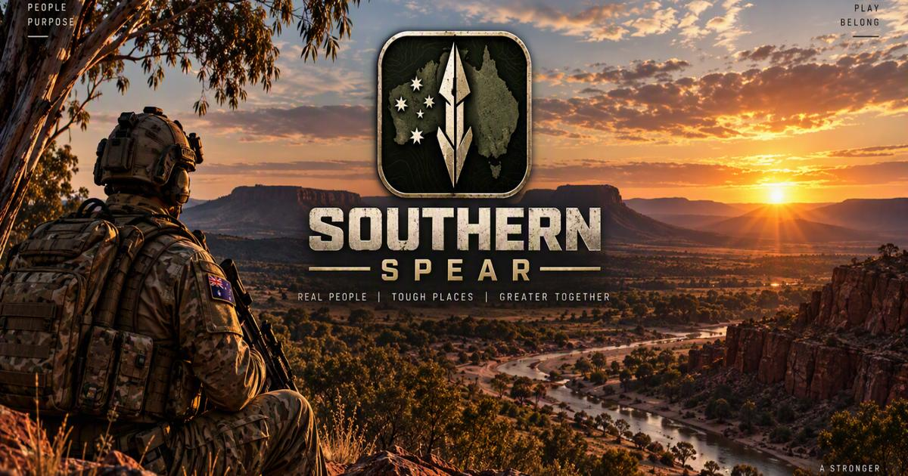

<p align="center"></p>

# Southern Spear — website

Public website and development portal for **Southern Spear**, a free, community-developed,
Australian-inspired tactical multiplayer FPS built on Unreal Engine 5.8 and the Lyra
Starter Game, and inspired by the design philosophy of the classic America's Army games.

**Status:** pre-alpha, in active development, and planned for Steam. There is no playable
release, no download, and no announced release date.

- Live site: https://theantipopau.github.io/southernspear-site/
- Rolling changelog: [`data/CHANGELOG.md`](data/CHANGELOG.md), one entry per working session,
  presented at [changelog.html](changelog.html)
- Roadmap: [`data/DEVELOPMENT_ROADMAP.md`](data/DEVELOPMENT_ROADMAP.md)

## What is in this repository

This repository is **generated** from the private game repository by `Tools/publish_site.py`.
It contains only the website and published documentation. No engine, Lyra or game content is
present, and none is ever published.

```
index.html      the site home
changelog.html  the full development changelog (search, filters, deep links)
presskit.html   press kit: fact sheet, descriptions, logo and artwork downloads
styles.css      design tokens and components
site.js         navigation, Markdown subset renderer, status / roadmap / changelog
404.html        not-found page
robots.txt      crawler policy
sitemap.xml     sitemap: home sections plus the changelog and press kit pages
manifest.webmanifest
assets/         optimised image derivatives (brand, hero, concepts, weapons, social, favicons)
fonts/          self-hosted latin subsets (Barlow Condensed, Inter, IBM Plex Mono)
data/           the published project documents, copied verbatim
```

The site is plain HTML, CSS and JavaScript. There is no framework, no bundler and no
third-party runtime dependency.

## How the images and fonts are produced

The canonical artwork lives in the private repository under `Docs/images/` and is never
modified. Web derivatives are generated by two scripts in that repository:

```
python Tools/build_site_assets.py    # brand variants, responsive derivatives, favicons
python Tools/build_site_fonts.py     # self-hosted font subsets
python Tools/publish_site.py         # build, then commit and push this repository
```

Brand variants are strict crops of the approved artwork. Nothing is redrawn, and the spear,
the Southern Cross and the approved proportions are untouched. The monochrome footer mark is a
CSS filter rather than a second drawing. The favicon suite is generated from the
producer-supplied multi-size icon (`Docs/images/SouthernSpear.ico`), the same file the game
executable installs, so the browser tab and the game show one mark.

The `weapons/` derivatives come from 3D studio renders made in the private repository with
`Tools/Blender/render_weapons.py`. They are renders of the current internal models, not captured
gameplay, and the site says so where they appear.

The project's own camouflage — used on the character in the game — is generated from noise by
`Tools/Textures/make_character_textures.py` and is original work, not a copy of any real-world
camouflage.

## Disclaimer

Southern Spear is an original work of fiction. It is not endorsed, sponsored, developed or
approved by the Australian Government, the Department of Defence, the Australian Defence Force
or the Australian Army. All organisations, units, forces and weapons are fictional, and no map
reproduces a real base, installation or operationally useful site.

Southern Spear is **inspired by the design philosophy of the classic America's Army games**, and
by nothing else from them. No source code, map layout, mission name, interface, audio, dialogue
or artwork is copied or reused, and none of their marks, names or insignia are used. It is not
affiliated with, endorsed by, sponsored by or approved by America's Army or the United States
Army. *America's Army* is a trademark of its respective owners, who do not endorse or sponsor
this project.

Unreal Engine and the Unreal Engine logo are trademarks of Epic Games, Inc. Lyra is a sample
project provided by Epic Games, Inc.
